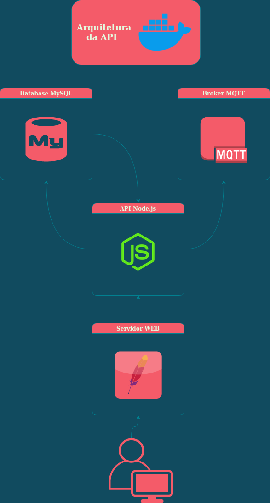

# Desafio Argos



### Instalando dependências
Acesse a pasta `./api` no terminal e execute:
```
npm install
```

### Construindo as imagens

Acesse a pasta raíz do projeto e construa a rota:

```
docker-compose up -d
```

### Acessando a API

Acesse o navegador e abra a página web no localhost:

```
firefox localhost:8888
firefox localhost:9001/led
```

### Enviando mensagens

Envie mensagens na rede com o protocolo MQTT para IOT:

```
sudo apt install mosquitto-clients
mosquitto_pub -t led -m clientID,aceso/apagado
```
